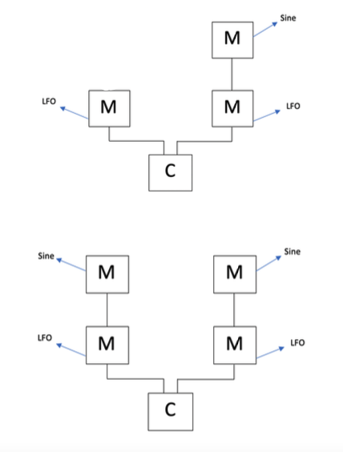

# Informatica applicata al suono
## Relazione del progetto relativo al modulo “pyo”

<h3>Introduzione</h3>

 
  Il progetto consiste nella simulazione di un synth FM attraverso il linguaggio Python.  
Ho deciso di realizzare una struttura iniziale composta da un segnale portante (carrier) e due diversi modulatori:

    

 

  Dopo di che ho deciso di dare la possibilità all’utente di ampliare la struttura aggiungendo uno o due modulatori, uno per ciascun segnale modulante già presente.  
Si possono quindi ottenere altre due strutture oltre alla prima già rappresentata:

 

    

 

<h3>Struttura del codice</h3>

 
  Per realizzare le diverse strutture presentate precedentemente ho implementato due diverse classi, “Oscillator” e “Mysynth”:

 
<h4>Classe Oscillator</h4>

  La classe “Oscillator” è definita come sottoclasse della classe “PyoObject”.  
Ho deciso di utilizzarla nella classe “MySynth” per istanziare due diversi tipi di modulatori, infatti nel costruttore vengono richiamati i costruttori delle classi “Sine” e “LFO”.  
Attributi della classe:

<ul>
  <li>f: frequenza dell’oscillatore.</li>
  <li>ratio: fattore moltiplicativo della frequenza portante. Rappresenta il rapporto tra frequenza
del segnale modulate e frequenza del segnale portante.</li>
  <li>modulatore: oggetto di tipo intero o PyoObject, rappresenta il modulatore della frequenza
dell’oscillatore; ha valore di default uguale a zero, usato nel caso in cui l’oscillatore in
questione non venga modulato in frequenza.</li>
  <li>mulindex: fattore utilizzato per controllare l’ampiezza del segnale modulante, in modo tale
da controllare l’incidenza di quest’ultimo sul segnale modulato.</li>
  <li>tipooscillatore: attributo che consente di scegliere quale oggetto istanziare nella classe
Oscillator, in particolare il valore 1 istanzia un oggetto di tipo Sine mentre il valore 0 un oggetto di tipo LFO, in questo modo si possono ottenere diversi tipi di modulazione della portante.</li>
</ul>
 

Metodi della classe:

<ul>
  <li>ctrl(): questo metodo della classe “Oscillator” richiama il metodo ctrl() dell’oggetto “osc”
istanziato nel costruttore della classe, che può essere di due tipi, Sine o LFO. In questo modo si otterranno due diversi tipi di finestre di controllo; inoltre aggiunge due SLMap alla map_list che consentono di regolare i valori di ratio e mulindex.</li>
  <li>play(), stop(), out(): sovrascrivono i metodi che consentono di ascoltare, stoppare e mandare in output il segnale.</li>
  <li>setF, setMulindex, setRatio: metodi che consentono di modificare i valori degli attributi f, mulindex e ratio.</li>
</ul>
 

<h3>Classe MySynth</h3>

  La classe “MySynth” è definita come sottoclasse della classe “PyoObject”.  
Istanzia oggetti della classe “Oscillator” e li utilizza come modulatori del segnale portante.  
  Il segnale portante viene istanziato come oggetto della classe Sine:

