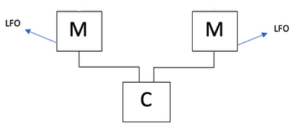

# Informatica applicata al suono
## Relazione del progetto relativo al modulo “pyo”

<h3>Introduzione</h3>

 
  Il progetto consiste nella simulazione di un synth FM attraverso il linguaggio Python.
Ho deciso di realizzare una struttura iniziale composta da un segnale portante (carrier) e due diversi modulatori:

    

